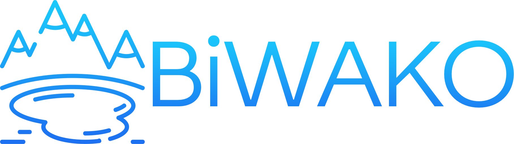
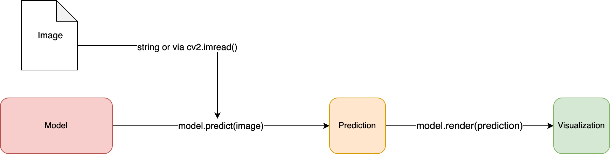

<div align="center">



### The home of moduled onnx models

[](https://pypi.org/project/NaMAZU/)
[](https://badge.fury.io/py/NaMAZU)
[](https://pepy.tech/project/NaMAZU)
[](https://github.com/NMZ0429/NaMAZU/blob/main/LICENSE)


* * *

</div>

# BiWAKO

## Usage

No matter which model you use, these interface is the same.

```python
import BiWAKO

# 1. Initialize Model
model = BiWAKO.MiDASInference(model_type="small")

# 2. Feed Image (accept cv2 image or path to the image)
prediction = model.predict(image_or_image_path)

# 3. Show result as a cv2 image
result_img = model.render(prediction, image_or_image_path)
```



## Models

|Task| Model| Weights|
|:----|:----|:----|
| Mono Depth Prediction | MiDAS | Large-Small |
| Salient Object Detection | U2Net | Basic-Mobile-Human |
| Super Resolution | RealESRGAN | Large-Small |
| Object Detection | YOLOv5 | nano-s-large-extreme |
| Emotion Prediction | FerPlus | ferplus8 |
| Human Parsing | HumanParsing |human_attribute |
| Denoise | HINet | denoise_320_480 |
| Face Detection | YuNet | yunet_120_160 |
| Style Transfer | GAN | animeGAN512 |
