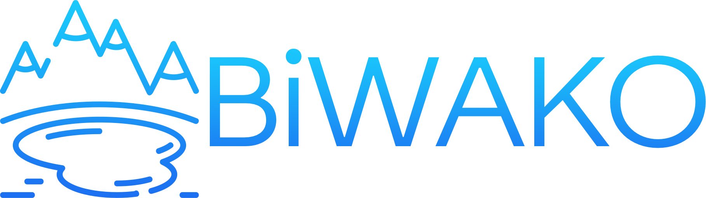
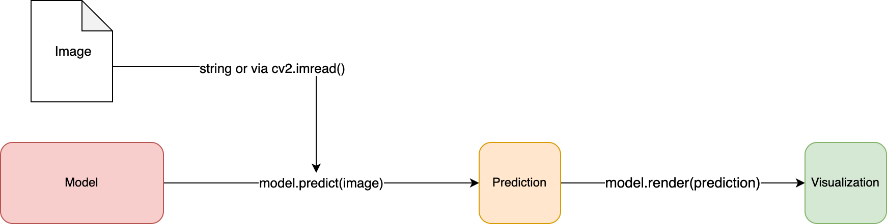

# 

## Usage

No matter which model you use, these interface is the same.

1. Instantiate model with `BiWAKO.ModelName(weight)`. `ModelName` and `weight` can be found at the table in the next section. Weight file is automaticaly downloaded.
2. call `predict(image)`. `image` can be either path to the image or cv2 image array.
3. call `render(prediction, image)`. `prediction` is the return value of `predict()` method.

```python
import BiWAKO

# 1. Initialize Model
model = BiWAKO.MiDAS(model_type="small")

# 2. Feed Image (accept cv2 image or path to the image)
prediction = model.predict(image_or_image_path)

# 3. Show result as a cv2 image
result_img = model.render(prediction, image_or_image_path)
```



## Models

|Task| Model| Weights|
|:----|:----|:----|
| Mono Depth Prediction | [MiDAS](mono_depth.md) | Large-Small |
| Salient Object Detection | [U2Net](salient_det.md) | Basic-Mobile-Human |
| Super Resolution | [RealESRGAN](super_resolution.md) | Large-Small |
| Object Detection | [YOLO](obj_det.md) | nano-s-large-extreme |
| Emotion Prediction | [FerPlus](emotion.md) | ferplus8 |
| Human Parsing | [HumanParsing](human_parsing.md) |human_attribute |
| Denoise | [HINet](denoising.md) | denoise_320_480 |
| Face Detection | [YuNet](face_det.md) | yunet_120_160 |
| Style Transfer | [AnimeGAN](style_transfer.md) | animeGAN512 |
