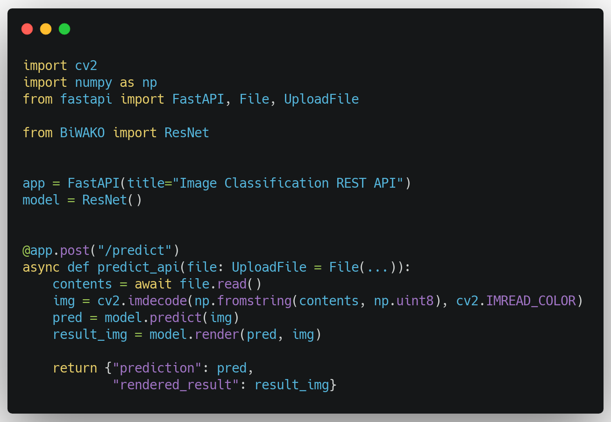

# 

## 0. Introduction

This repository offers

1. **Models**: Trained state-of-the-art models for various vision tasks in ONNXRuntime backend
2. **No-Code Modules**: Easy interface to use those models for both prediction and visualizing output. No coding is needed. The interface is universal among all models in this library.
3. **Extentiability**: Customizable modules to use it for applications such as realtime inference.

## 1. Installation

Install directly from this repository.

```sh
$cd BiWAKO
$pip install -e .
```

!!! warning
    Downloading from pip server is currently suspended in order to protect weight files. We will update it soon.

## 2. Usage


No matter which model you use, these interface is the same.

1. Instantiate model with `BiWAKO.ModelName(weight)`. The corresponding `ModelName` and `weight` to the task you want to work on can be found at the table in the next section. Weight file is automaticaly downloaded.
2. call `predict(image)`. `image` can be either path to the image or cv2 image array.
3. call `render(prediction, image)`. `prediction` is the return value of `predict()` method and `image` is the same as above. Some model takes optional arguments to control details in the output.

```python
import BiWAKO

# 1. Initialize Model
model = BiWAKO.MiDAS(model="mono_depth_small")

# 2. Feed Image (accept cv2 image or path to the image)
prediction = model.predict(image_or_image_path)

# 3. Visiualize result as a cv2 image
result_img = model.render(prediction, image_or_image_path)
```

## 4. Models

The following list is the current availability of models with weight variations.  
Click the link at the model column for futher documentation.

|Task| Model| Weights|
|:----|:----|:----|
| Mono Depth Prediction | [MiDAS](mono_depth.md) | mono_depth_small-mono_depth_large |
| Salient Object Detection | [U2Net](salient_det.md) | Basic-Mobile-Human |
| Super Resolution | [RealESRGAN](super_resolution.md) | Large-Small |
| Object Detection | [YOLO](obj_det.md) | nano-s-large-extreme |
| Emotion Prediction | [FerPlus](emotion.md) | ferplus8 |
| Human Parsing | [HumanParsing](human_parsing.md) |human_attribute |
| Denoise | [HINet](denoising.md) | denoise_320_480 |
| Face Detection | [YuNet](face_det.md) | yunet_120_160 |
| Style Transfer | [AnimeGAN](style_transfer.md) | animeGAN512 |
| Image Classification | [ResNetV2](image_clf.md) | resnet152v2-resnet101v2-resnet50v2-resnet18v2 |

## 5. Deployment

It is extremely easy to use BiWAKO at application layer.

!!! Tip "1. Real Time Prediction"
    { align=left style="height:300px;width:450px"}
    Any models can be used in the same way to run real-time inference.

!!! Tip "2. FastAPI Implementation"
    {align=left style="height:300px;width:450px"}
    Like the above example, you can build simple Backend API for inference on web server.
