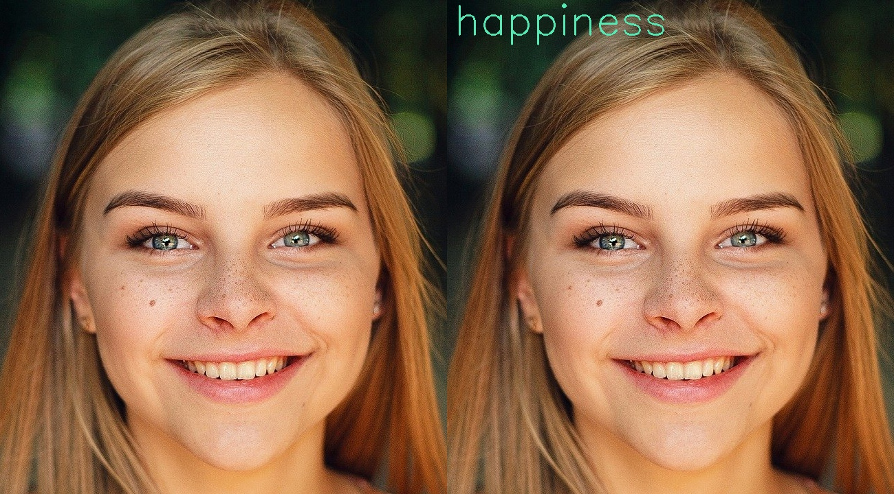

# Emotion Recognition

<figure markdown>
  { width="700" }
  <figcaption>Original image and denoised image</figcaption>
</figure>

## `BiWAKO.FerPlus`

::: BiWAKO.FerPlus
    handler: python
    selection:
        members:
            - __init__
            - predict
            - render
    rendering:
        show_root_heading: false
        show_source: false
