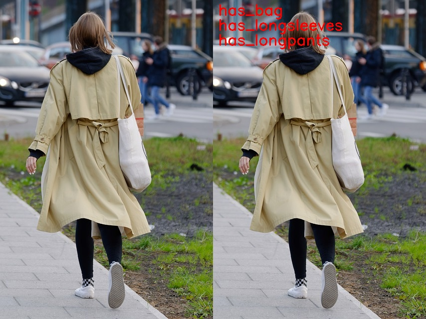

# Human Parsing

<figure markdown>
  { width="700" }
  <figcaption>Query image and prediction</figcaption>
</figure>

## `BiWAKO.HumanParsing`

::: BiWAKO.HumanParsing
    handler: python
    selection:
        members:
            - __init__
            - predict
            - render
    rendering:
        show_root_heading: false
        show_source: false
