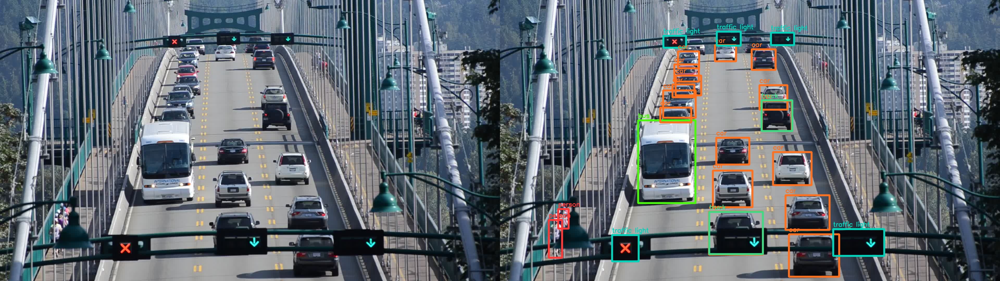

# Object Detection

<figure markdown>
  { width="700" }
  <figcaption>Query image and prediction</figcaption>
</figure>

Currently, there are two YOLOv5 implementations avaialables for object detection task. Old implementation will be removed in future version.

Those models contains a large number of pretrained weights. Please refer to the following table for available options.  
The first letter `nano, s, ...` is the scaling and suffix `simp` means the model is simplified by onnx simplifier. With the number `6`, the model is updated to the upstream version of YOLOv5.

| Model| Weights| Model | Weights |
|:----|:----|:----|:----|
| YOLO2 | yolo_nano yolo_nano6 yolo_nano_simp yolo_nano6_simp yolo_s yolo_s6 yolo_s_simp yolo_s6_simp yolo_m yolo_m6 yolo_m_simp yolo_m6_simp yolo_l yolo_l_simp yolo_x yolo_x6 yolo_x_simp yolo_x6_simp | YOLO | yolo_nano yolo_s yolo_xl yolo_extreme yolo_nano_smp yolo_s_smp yolo_xl_smp yolo_extreme_smp |

---

## `BiWAKO.YOLO2`

!!! note
    It is recommended to use this model rather than previous YOLO. This model optimizes pre/post-processing operations with new ort opsets. Runtime is 3~4 times faster than the previous model. If you want to use the raw output of the YOLO or customize post-processing with your choice of parameters, use the previous model below.

::: BiWAKO.YOLO2
    handler: python
    selection:
        members:
            - __init__
            - predict
            - render
    rendering:
        show_root_heading: false
        show_source: false

---

## `BiWAKO.YOLO`

::: BiWAKO.YOLO
    handler: python
    selection:
        members:
            - __init__
            - predict
            - render
    rendering:
        show_root_heading: false
        show_source: false
